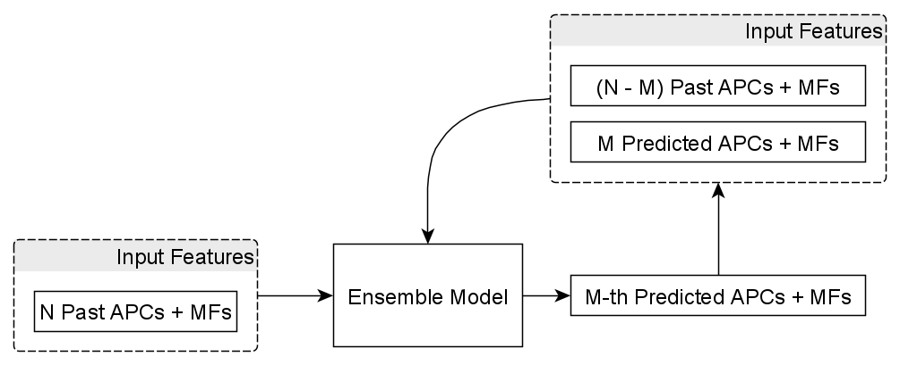

# Stacked Generalization Ensemble Learning for Air Pollutant Concentration Prediction
We aim to create an regressor ensemble model composed of models which are analyzed separately and then combined together using the stacked generalization algorithm from the sklearn library.

There are five primary regressor models that compose the ensemble:
1. Random Forest
2. Stochastic Gradient Boosting
3. K-Nearest Neighbors
4. SVR

For the meta-learner, we used Linear Regression.

all of these models and the stacking ensemble can be found in the [python sklearn library](https://scikit-learn.org/stable/index.html)

# How the model works

Where: 
* **APC** - air pollutant concentration e.g. CO in ppm, NO2 in ppb, PM2.5 in ug/m3 etc.
* **MFs** - meteorological factors e.g. temperature, humidity, wind speed etc.
* **N** - sliding window size for the input features i.e. lagged features
* **M** - forecast window size or number of time step predictions to make, in the figure, it is the desired time step to make the predictions.

Although it also predicts the MFs, we ignore them in the output selection especially for the discrete features e.g. wind direction and weather condition which are unreliable since we treat the problem as a regression problem, and they are not the actual target variables to predict.

This is best explained in this [article](https://machinelearningmastery.com/multi-step-time-series-forecasting-with-machine-learning-models-for-household-electricity-consumption/) on how the logic of this model works.

This model is inspired and based on a published paper. [1]

[1] K. Gu, J. Qiao and W. Lin, "Recurrent Air Quality Predictor Based on Meteorology- and Pollution-Related Factors," in IEEE Transactions on Industrial Informatics, vol. 14, no. 9, pp. 3946-3955, Sept. 2018, doi: 10.1109/TII.2018.2793950.
